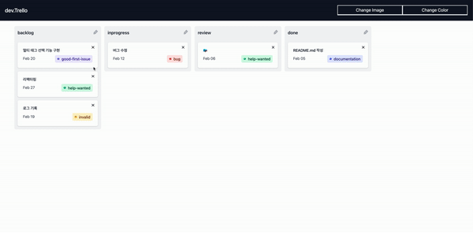

<h1 align="center">Welcome to kanban 👋</h1>
<p>
  <a href="https://www.npmjs.com/package/kanban" target="_blank">
    
  </a>
  <a href="https://github.com/Baek2back/kanban#readme" target="_blank">
    
  </a>
  <a href="https://github.com/Baek2back/kanban/graphs/commit-activity" target="_blank">
    
  </a>
</p>

## ✨ Demo



## Project Structure

### 🏠 [Homepage](https://github.com/Baek2back/kanban#readme)

## Install

### client

```sh
npm run install
```

## Author

- Github: [@Baek2back](https://github.com/Baek2back)

## 🤝 Contributing

Contributions, issues and feature requests are welcome!<br />Feel free to check [issues page](https://github.com/Baek2back/kanban/issues). You can also take a look at the [contributing guide](https://github.com/Baek2back/kanban/blob/master/CONTRIBUTING.md).

## Show your support

Give a ⭐️ if this project helped you!

## 📝 License

This project is [ISC](https://github.com/Baek2back/kanban/blob/master/LICENSE) licensed.

---

_This README was generated with ❤️ by [readme-md-generator](https://github.com/kefranabg/readme-md-generator)_
